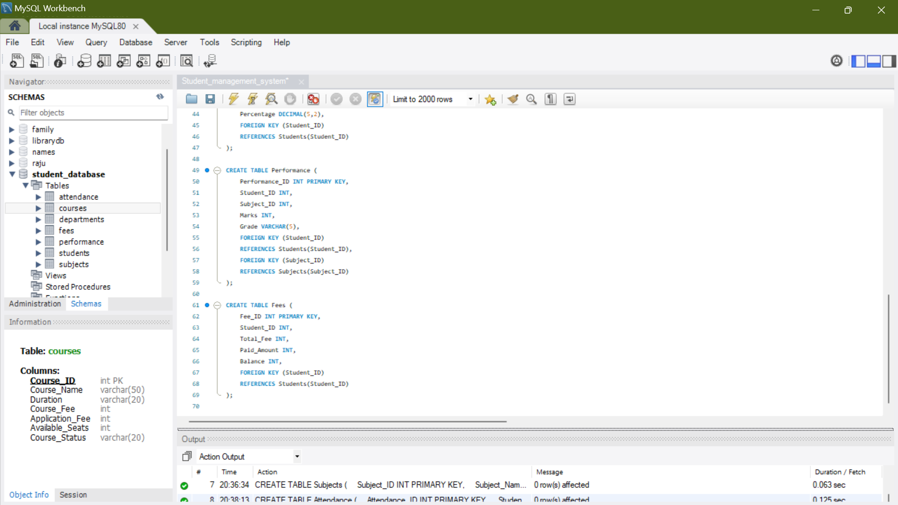
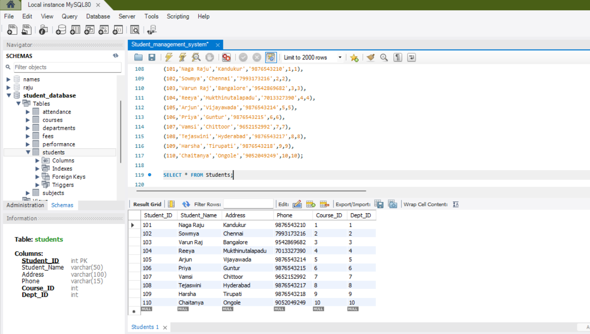
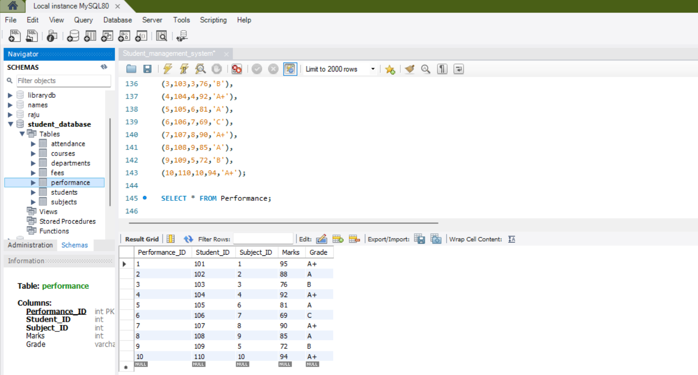
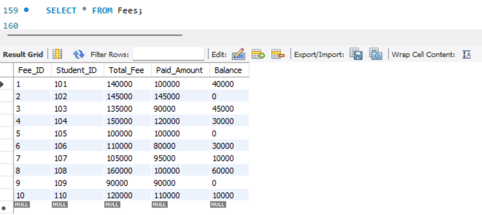
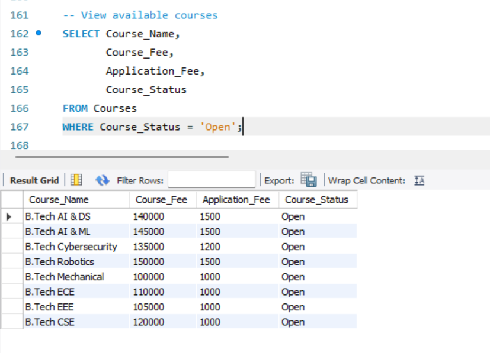
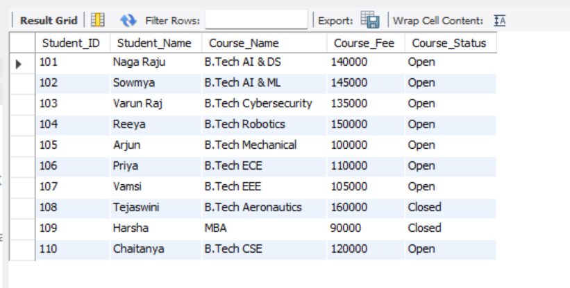
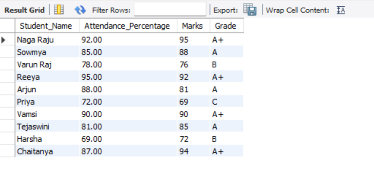
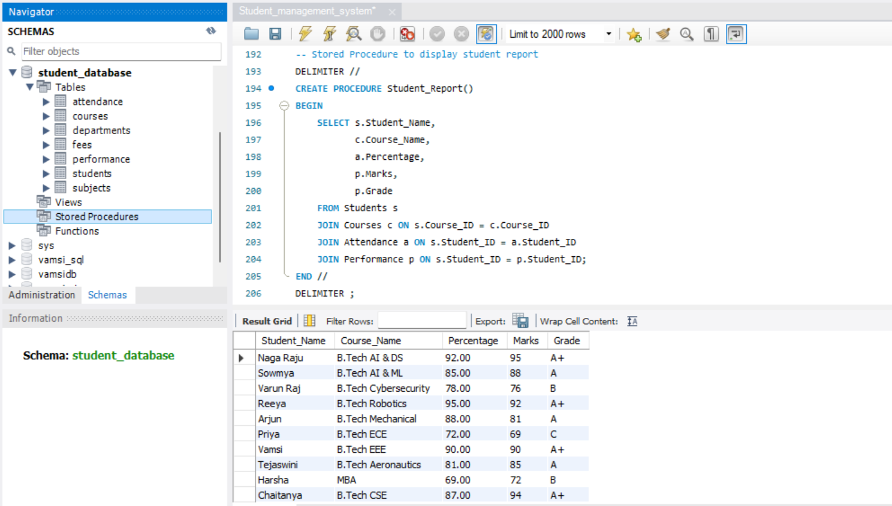

# 🎓 Student Database Management System

The Student Database Management System is a SQL-based project developed to manage and organize student-related information efficiently.

This project focuses on creating a structured relational database with real-world college management operations such as student enrollment, course management, attendance tracking, performance analysis, and fee management using SQL queries.
---

## 🚀 Features

* Manage student records
* Course management system
* Attendance tracking system
* Performance and grade management
* Fee management system
* Open and closed course availability
* SQL filtering and search queries
* JOIN operations between tables
* Dashboard reports and statistics
* Stored Procedures
* Triggers

---

## 🛠 Technologies Used

* MySQL
* MySQL Workbench
* SQL

---

## 🗂 Database Tables

🎓 Courses

```
  Stores course details, fee structure, duration, and availability status.
```

🏢 Departments

```
  Stores department and HOD details.
```

👨‍🎓 Students

```
  Stores student personal and academic details.
```

📚 Subjects

```
  Stores subject information.
```

📊 Attendance

```
  Stores attendance records and percentage details.
```

🏆 Performance

```
  Stores marks and grades of students.
```

💰 Fees

```
  Stores fee payment and balance details.
```

---

## 🔍 SQL Operations Included

* Database Creation
* Table Creation
* Data Insertion
* SELECT Queries
* WHERE Conditions
* JOIN Queries
* COUNT Queries
* Stored Procedures
* Triggers
* Foreign Key Relationships

---

## ▶ How to Run

1. Open MySQL Workbench

2. Open " student_management.sql "

3. Run the complete script using :

   " Ctrl + Shift + Enter "

---

## 📁 Project Structure

Student Database Management System/
│
├── student_database_management_system.sql
├── README.md
└── Screenshots/

---

## 📸 Project Screenshots

🗂 Tables Created

```

```

👨‍🎓 Students Table

```

```

🏆 Performance Table

```

```

💰 Fees Table

```

```

📚 Available Courses Report

```

```

🎓 Student & Course Report

```

```

📊 Attendance & Performance Report

```

```

⚡ Stored Procedure Report

```

```

---

## ✅ Project Outcome

This project helped in understanding:

* Relational Database Design
* SQL Query Writing
* Data Relationships
* Stored Procedures
* Triggers
* Report Generation
* Practical Database Operations

---

⭐ Thanks for checking out this project.
